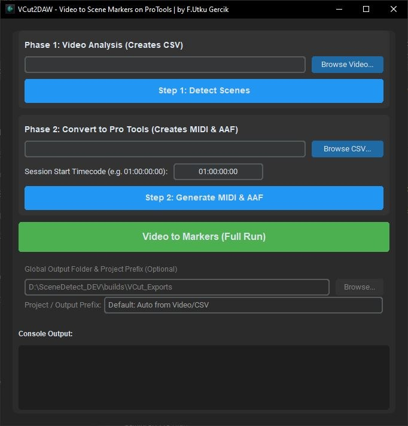

# VCut2DAW (Open Source Conform Assistant)

VCut2DAW is an open-source video-to-DAW pipeline tool designed specifically for Sound Editors and Assistant Editors. It automatically detects visual cuts from a video (or parses CMX3600 EDLs) and generates **100% compliant Dummy AAFs and MIDI Markers** perfectly synced for DAWs (Pro Tools, Nuendo, Reaper, Logic, etc.).




## Why This Exists? (The Technical Edge)
- **DAW AAF Strictness (Pro Tools, Nuendo):** Pro Tools 12.5+ aggressively rejects standard OTIO AAFs. VCut2DAW uses `pyaaf2` to build compliant `SourceMob` and `MasterMob` hierarchies with valid `PCMDescriptor`s so DAWs (especially Pro Tools) never throw an import error.
- **The "1-Frame Drift" Fix:** AI cut detection often places the cut on the first *new* frame, resulting in a 1-frame offset compared to traditional NLE edits. This tool automatically mathematically shifts all cuts 1 frame left and fills the timeline gap to ensure perfect frame sync with the picture department.
- **The "120 BPM" MIDI Sync Issue:** DAWs (like Pro Tools) often force their session tempo (default 120 BPM) onto imported MIDI markers unless you overwrite the tempo map. This tool mathematically hardcodes the MIDI tick scale to assume 120 BPM (`ticks_per_beat = 12000`), ensuring 01:00:00:00 lands exactly at 1 hour, not 30 minutes!

## Features
- **Video to Cuts:** Select an MP4/MOV and get a frame-accurate CSV.
- **EDL Support:** Got an EDL from the editor? Drop the `.edl` file directly into Step 2!
- **Dummy AAF Generation:** Generates a Clip Track allowing you to use `Tab to Transient` to jump between scenes.
- **Session Start Timecode Offset:** Input your session start (e.g., `01:00:00:00`) and the files will spot perfectly without manual offset mapping.

## Installation

### For Windows
Double click the `compile_windows.bat` file. It will automatically download dependencies, compile the source code into a standalone `.exe`, and place it in the `builds/` folder for you to run!

### For macOS / Linux
Open your terminal, navigate to the folder, and run:
```bash
chmod +x compile_mac.sh
./compile_mac.sh
```

## 💡 Important Pro Tools / DAW Tips (FAQ)

**1. "My MIDI markers don't line up with the video!" (The 120 BPM Rule)**
DAWs like Pro Tools tie MIDI marker timecodes to the session's tempo map. **Your DAW session tempo MUST be set to exactly 120 BPM** when you import the MIDI file. If your session is set to 120 BPM, the markers will be 100% frame-accurate.

**2. Session Start Timecode Mismatch**
The `Session Start Timecode` you type into the VCut2DAW app (e.g. `01:00:00:00`) **must exactly match** your DAW's Session Start Time. If the app is set to `01:00:00:00` but your Pro Tools session starts at `00:00:00:00`, the AAF and MIDI will import 1 hour late.

**3. The AAF Audio is Offline / Empty?**
**This is intentional.** The tool generates a "Dummy" AAF track. It has no real audio. Its sole purpose is to create empty clips on your timeline so you can use the `Tab to Transient` (or `Tab to Clip Boundary`) shortcut to instantly jump your playhead to the exact start of the next visual scene cut.

## License
This project is licensed under the **Creative Commons Attribution-NonCommercial (CC BY-NC 4.0)** license.
You are free to use, share, and modify this code for your personal or studio workflows, but **you may not use this software for commercial monetization or sell it as a paid product/service**. 

## Author
**Furkan Utku Gerçik**  
Link: [https://rhinofug.github.io](https://rhinofug.github.io)  
GitHub: [github.com/rhinofug/VCut2DAW](https://github.com/rhinofug/VCut2DAW)

<a href="https://buymeacoffee.com/rhinofug" target="_blank"></a>
 

*Protected with Watermark technology.*
## Acknowledgments & Open Source Credits
This project stands on the shoulders of giants. VCut2DAW would not be possible without the incredible work done by the open-source community. Special thanks to the creators of the core engines powering this app:

- **[PySceneDetect](https://github.com/Breakthrough/PySceneDetect) (by bcastillox):** For the incredibly robust frame-analysis and cut detection engine.
- **[pyaaf2](https://github.com/markreidvfx/pyaaf2) (by markreidvfx):** For the brilliant AAF reading/writing library that made Pro Tools integration possible.
- **[Mido](https://github.com/mido/mido):** For handling all the complex MIDI object generation.
- **[CustomTkinter](https://github.com/TomSchimansky/CustomTkinter):** For providing the sleek, modern dark-mode GUI.

*Thank you for keeping open-source post-production alive!*


